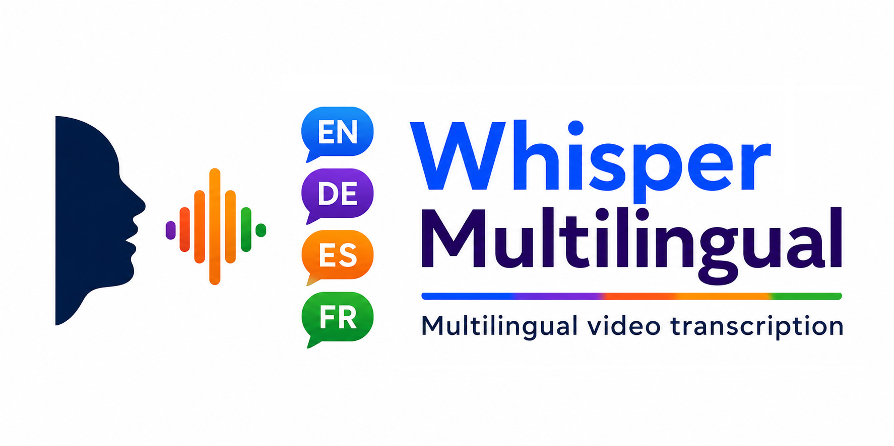

# WhisperMultilingual

<p align="center">
  
</p>

<p align="center">
  <strong>Multilingual video transcription</strong>
</p>

WhisperMultilingual is a Windows command-line tool for transcribing videos that switch between multiple spoken languages.

The project was developed after the author encountered a practical limitation when transcribing multilingual spiritual discourses: the Whisper transcription engine did not reliably detect language changes automatically. As a result, parts of a multilingual recording could be transcribed in the wrong language after a language switch.

WhisperMultilingual addresses this problem by detecting language changes before transcription and then processing the individual language regions separately.

The project was developed with the assistance of artificial intelligence (AI), which was used throughout the development process for programming, debugging and improving the workflow.

Its main feature is **automatic language-change detection**. The detected language markers are written to a `.languages.auto.txt` file. These markers are then used to split the video into language-specific audio segments, which are transcribed separately with Faster-Whisper-XXL. The resulting SRT files are then merged back together into a single final subtitle file, preserving the original timing and sequence of the video.

## Features

- Automatic detection of language changes
- Configurable detection languages
- Ignores short language insertions below a configurable duration
- Manual `.languages.txt` files can always be used instead
- Existing `.languages.auto.txt` files are reused
- Single-video mode
- Batch processing of all videos in a configured folder
- Separate SRT files are merged into one final subtitle file
- Language files can also be used directly as YouTube chapter timecodes
- Tested with German/English multilingual spiritual discourses

## Requirements

WhisperMultilingual is currently designed for **Windows** and a CUDA-capable NVIDIA setup.

You need:

1. Python with the packages in `requirements.txt`
2. FFmpeg
3. Purfview Faster-Whisper-XXL
4. A compatible NVIDIA/CUDA environment for the Faster-Whisper Python language detector

The Purfview executable is **not included** in this repository. Download it separately from:

https://github.com/Purfview/whisper-standalone-win

WhisperMultilingual currently uses the Faster-Whisper-XXL executable for the actual transcription and the Python `faster-whisper` package for language detection.

## Installation

Clone or download the repository and install the Python dependencies:

```bat
python -m pip install -r requirements.txt
```

Install/download FFmpeg and Faster-Whisper-XXL separately.

## Configuration

Copy `config.example.py` to `config.py` and edit `config.py` with your local paths and settings.

`config.py` is intentionally not included in the Git repository because it contains machine-specific paths.

You do not need to change the Python source code for normal setup.

At minimum, edit:

```python
VIDEO_DIR = Path(r"C:\Path\to\Videos")
LANGUAGE_DIR = Path(r"C:\Path\to\LanguageFiles")

FFMPEG_EXE = Path(
    r"C:\Path\to\ffmpeg.exe"
)

WHISPER_EXE = Path(
    r"C:\Path\to\Purfview-Faster-Whisper-XXL\faster-whisper-xxl.exe"
)
```

`TEMP_DIR` and `OUTPUT_DIR` default to folders inside the project directory, but they can also be changed in `config.py`.

## Language detection

The example configuration enables German and English, which are the languages used for testing.

Additional languages can be enabled by uncommenting or adding entries to `DETECTION_LANGUAGES`:

```python
DETECTION_LANGUAGES = {
    "de": "Deutsch",
    "en": "English",

    # Optional: additional languages
    # "fr": "Français",
    # "es": "Español",
    # "it": "Italiano",
    # "ar": "Arabic",
}
```

The entries use Whisper language codes. Add or remove languages as required.

Two settings control the basic language detection:

```python
LANGUAGE_THRESHOLD = 0.60
MIN_LANGUAGE_DURATION = 15
```

`LANGUAGE_THRESHOLD` defines the minimum probability required for a language to be considered a valid observation.

`MIN_LANGUAGE_DURATION` defines the minimum duration required for a detected language region to be retained. Short language insertions below this duration are ignored.

The detector also uses configurable sliding-window and confirmation settings:

```python
LANGUAGE_WINDOW = 5
LANGUAGE_STEP = 2
LANGUAGE_CONFIRM_WINDOWS = 3
```

These settings control the size and movement of the audio analysis windows and how many consecutive observations are required to confirm a language change.

## Initial prompt

The `INITIAL_PROMPT` can contain vocabulary that is useful for the subject of the videos. The example configuration uses neutral terms related to spirituality and psychology.

Adapt this list to the subject of your own videos if necessary.

### Subtitle formatting

The maximum line length and the maximum number of lines per subtitle can be configured in `config.py`:

```python
MAX_LINE_WIDTH = 42
MAX_LINE_COUNT = 2

## Usage

### Check the command line

```bat
python whisper_multilingual.py --help
```

### Process one video

```bat
python whisper_multilingual.py myvideo.mp4
```

The application looks for a manual language file first:

1. next to the video
2. then in `LANGUAGE_DIR`

It then looks for an existing automatic language file and only runs automatic language detection when necessary.

### Use a specific language file

```bat
python whisper_multilingual.py myvideo.mp4 myvideo.languages.txt
```

### Batch processing

```bat
python whisper_multilingual.py --batch
```

All supported video files in `VIDEO_DIR` are processed sequentially.

A failure in one video does not stop the remaining batch.

## Language files

A language file contains one language marker per line:

```text
0:00 DE
6:47 EN
8:09 DE
11:46 EN
```

The first marker must be at `0:00`.

Supported language names may be written using the configured language code or common English/German names, for example:

```text
0:00 Deutsch
6:47 English
```

Manual language files use the `.languages.txt` suffix.

Automatically generated language files use the `.languages.auto.txt` suffix.

If a manually checked `.languages.txt` exists, it takes precedence over automatic detection.

## Using language files for YouTube chapters

The generated language file can also be used as a simple source for YouTube chapter timecodes.

The timestamps can be copied **1:1 into the YouTube video description** if you want to create chapter markers based on the detected language changes.

For example:

```text
0:00 DE
6:47 EN
8:09 DE
11:46 EN
```

You can rename or expand the chapter titles afterwards if desired.

This makes the `.languages.txt` / `.languages.auto.txt` file useful not only for the transcription workflow but also for preparing multilingual YouTube videos.

## Generated files

The application writes generated files to `OUTPUT_DIR`.

For example:

```text
myvideo.languages.auto.txt
myvideo.subtitles.srt
```

Temporary segment WAV/SRT files are stored in `TEMP_DIR`.

## Workflow

```text
Video
  |
  v
Automatic language detection
  |
  +--> .languages.auto.txt
  |
  v
Language segments
  |
  v
Faster-Whisper-XXL transcription
  |
  v
Merged SRT
```

If a manually checked `.languages.txt` exists, it takes precedence over automatic detection.

## Notes on automatic detection

The detector analyzes overlapping short audio windows and confirms a language change only after repeated observations.

Short interruptions are filtered using `MIN_LANGUAGE_DURATION`.

The detector is intended to find **spoken-language regions**, not to decide whether a given region should be translated or transcribed.

For special cases such as a song or prayer that should not be transcribed, `.languages.auto.txt` can be edited manually before transcription.

For example, an automatically detected language region can be removed or modified in the language file before the transcription process is started.

This allows the automatic detection to serve as a starting point while still giving the user full control over the final language segmentation.

## Manual language files

Automatic language detection is optional.

A manually prepared `.languages.txt` file can always be used instead. This is useful when:

- the automatic detection is not accurate enough
- the recording contains songs or prayers
- very short language changes should be handled manually
- a particular section should be assigned to a specific language
- the user already knows the exact language structure of the recording

The manual file takes precedence over `.languages.auto.txt`.

## Why WhisperMultilingual?

Standard Whisper-based transcription can work very well with multilingual audio, but automatic language detection may not reliably follow language changes within a single recording.

This can be particularly problematic in recordings where the speaker switches repeatedly between languages.

WhisperMultilingual separates the language-detection step from the transcription step:

1. Detect the spoken languages.
2. Determine where language changes occur.
3. Split the audio into language-specific regions.
4. Transcribe each region with the appropriate language.
5. Merge the resulting subtitle files.

This approach makes multilingual transcription more predictable and gives the user the opportunity to review and correct the detected language structure before transcription.

## Support

WhisperMultilingual is free and open source.

If you find the project useful and would like to support its
continued development, you can buy the author a coffee via PayPal.

[](https://paypal.me/FriederRosenfelder)

## Community

Have a question, suggestion or idea for WhisperMultilingual?

Visit the [GitHub Discussions](../../discussions) to ask questions,
share your experience or suggest improvements.

## License

WhisperMultilingual is released under the MIT License. See `LICENSE`.

Third-party software is not bundled with this repository and remains subject to its own licenses. See `THIRD_PARTY.md`.
